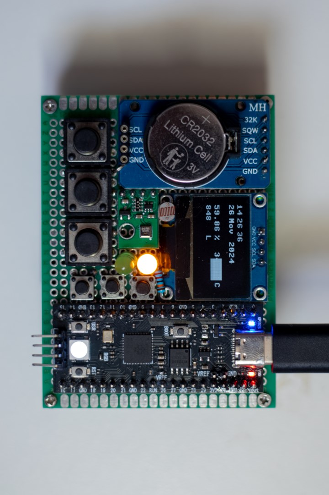

# Pyogotchi: Tamagotchi on Steroids
---
This project aims to create a Tamagotchi-like simulation game for the Raspberry Pi Pico. The game allows users to experience the joy of having a customizable virtual pet without the additional costs and commitments associated with real pets. By integrating various sensors, including photoresistors, an RFID reader, and a 2.4GHz radio, the game will feature engaging behaviors and interactions that enhance the user experience.



Included are MicroPython library implementations for:
- SSD1306
- AHT20
- DS3231
- NRF24L01 (TODO)
- RC522 (TODO)


Documentations for these libraries can be found (once they are written) [here](https://github.com/sydneycally-inclane-2812/pyogotchi/blob/84fb608efcce4971d4bae1670eec62210f19c055/documentation/progress/vision.md). 


Advancements compared to the original:
| Component                        | Pyogotchi                         | Original Tamagotchi                |
|----------------------------------|--------------------------------------|------------------------------------|
| **Microcontroller**              | 32-bit RP2040 with 264KB SRAM + 16MB Flash| 8-bit or 16-bit microcontroller    |
| **Real-Time Clock (RTC)**        | Yes                                  | No                                 |
| **Display**                      | 128x64 pixel OLED                     | Monochrome LCD (32x16 pixels)     |
| **Battery**                      | 2000mAh rechargeable Li-ion          | CR2032 coin cell                   |
| **Temperature and Humidity Sensor** | Yes                              | No                                 |
| **RFID Module**                 | Yes                                  | No                                 |
| **2.4GHz Radio Module**         | Yes                                  | No                                 |

## Current Progress
- [ ] Implemented MicroPython libraries for AHT20, DS3231, SSD1306, and RC522 modules (RC522 and NRF24L01+ modules not installed yet)
- [ ] Developed a custom graphics engine for the SSD1306, improving text capabilities and sprite handling
- [ ] Created a foundational game engine
- [ ] Established behavior flow for the virtual pet
- [ ] Designed and created sprites for the game


## Sprite Editor

Alongside developing a framework in MicroPython, I've utilized the Tkinter library to write a simple Python program to easily design, save, and share a sprite for a monochromic display.

### Usage

To use, simply download the latest release from the `Releases` tab, and run the executable file.

### Recompiling

To recompile the program, follow these steps:

1. Clone the project:
   ```sh
   git clone https://github.com/sydneycally-inclane-2812/pyogotchi.git
   cd ./basic_sprite_editor
   ```

2. Install the required library (`pyinstaller`), either in a virtual environment or globally:
   ```sh
   pip install pyinstaller
   ```

3. Run PyInstaller to create the executable:
   ```sh
   pyinstaller --onefile --windowed ./v3.py
   ```

4. Locate the output file in the `dist` directory.

Alternatively, you can simply run the latest `.py` script in the `.\basic_sprite_editor` folder if you have Python installed:
   ```sh
   python ./v3.py
   ```

## Future Improvements
- Upgrade to a more powerful microcontroller (RPi Pico 2W 16MB when available)
- Integrate additional sensors, such as accelerometers and Wi-Fi capabilities

## Contributing
Contributions are welcome! If you have suggestions for improvements or features, please feel free to submit a pull request or open an issue.

## License
The design, behaviors and other creative works of the Pyogotchi © 2024 is licensed under CC BY-NC-SA 4.0. Distribution and sharing of the framework, libraries and its permutations are permitted with no restrictions.

